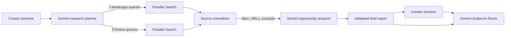

# Yuvo

> Find the whitespace around your story.

Yuvo is a creative intelligence tool for independent filmmakers, screenwriters, and digital storytellers. Before a creator spends months making something, it maps the creative territory around their premise, surfaces recurring audience friction, and turns those signals into grounded differentiation opportunities.

Built for the **Agentic Cinema Hackathon — Parallel track**.

## The problem

Creative teams can find endless AI idea generators, but very few tools answer the harder question: *What territory already surrounds this idea, what keeps recurring there, and where are audiences still underserved?*

Claims of “objective originality” are misleading. Search result counts are not an inventory of culture, and synthetic personas cannot predict real audiences.

## The solution

Yuvo researches the live web before offering advice. Its single workflow is designed for a three-minute demo:

1. Paste a story premise or load the built-in example.
2. Gemini decomposes it into six targeted research angles.
3. Parallel Search researches creative comparables and audience/critic friction concurrently.
4. Gemini synthesizes a sourced creative landscape, saturated territory, friction, and 2–4 whitespace opportunities.
5. Revise the premise and send it to the Audience Room.
6. Three synthetic perspectives compare the new iteration with the original idea and the research.
7. Attach an MP4 or WebM cut for timestamped Gemini feedback. Upload a revision to compare both actual videos.

The interface labels every conclusion with calibrated language such as “sources surfaced,” “recurring signal,” and “potential whitespace.” It never claims to have searched the entire internet or certified originality.

## Agent architecture



This is intentionally one understandable orchestrator, not a large multi-agent system. Independent Parallel requests run concurrently, related queries share a session ID, and one failed branch can still produce a deliberately narrow partial report. If no evidence is returned, Yuvo does not fabricate an analysis.

## Parallel integration

Parallel is used during the live user workflow through the server-side `POST /v1/search` API. Each analysis sends two focused requests with three concise searches each:

- creative works, themes, mechanics, and tropes;
- reviews, criticism, complaints, and unmet expectations.

The API runs in `fast` mode with bounded result/context sizes for demo latency. Returned titles, URLs, dates, and excerpts remain attached to the report as numbered evidence. API keys never reach the browser.

## Gemini integration

Google ADK (`@google/adk`) runs a request-scoped `LlmAgent` and `InMemoryRunner` for Gemini 3.8 Flash on Vertex AI. ADK uses the official Google Gen AI client internally:

- research-query planning;
- evidence-grounded opportunity synthesis;
- revised-idea critique in the Audience Room;
- multimodal review of a cut, followed by comparison against the previous video.

All tasks request structured JSON. Results pass through small runtime validators before rendering, and citation IDs are restricted to URLs actually returned by Parallel.

## Run locally

Requirements: Node.js 24.13+ and a [Parallel](https://platform.parallel.ai/) key, plus Vertex AI credentials or a [Google AI Studio](https://aistudio.google.com/) key.

```bash
npm install
cp .env.example .env.local
npm run dev
```

Open [http://localhost:3000](http://localhost:3000).

### Environment variables

```dotenv
PARALLEL_API_KEY=your_parallel_api_key
GEMINI_API_KEY=your_gemini_api_key
GEMINI_MODEL=gemini-3.8-flash
```

`GEMINI_MODEL` defaults to the user-selected `gemini-3.8-flash`. Gemini 3 calls use low thinking effort and no deprecated sampling parameters, following the [official migration guide](https://ai.google.dev/gemini-api/docs/generate-content/latest-model). Each model call has a 150-second total deadline and an 8,192-token output limit. Timeouts preserve user input; provider errors are not replaced with sample results.

## Demo path

Use **Use an example** to load the hackathon concept, then run live research. If credentials are unavailable during judging, **View a sample report** opens a prepared report that is explicitly marked as non-live. This never replaces or masquerades as the real Parallel integration. The landing includes a silent 52-second HyperFrames desktop walkthrough with pause and reduced-motion support. Inside the sample report, use **Use the sample revision** and **View sample feedback** to complete the prepared demonstration without API keys. Feedback is fixed to that revision and explicitly labeled as non-live.

With the app running, check the browser flow with `bash scripts/check-ui.sh http://localhost:3017`. The editable video composition lives in `videos/landing-demo`.

## Checks

```bash
npm test
npm run build
npm audit --omit=dev
```

## Responsible claims and limitations

- Results reflect the sources surfaced for a limited set of targeted searches, not exhaustive internet coverage.
- “Saturated” and “friction” describe recurring qualitative signals, not statistically representative measurements.
- Creative whitespace is a research-grounded opportunity, not proof that a concept has never existed.
- Audience Room voices are synthetic critical lenses, not predictions of real audience behavior.
- Source quality varies across criticism, reference material, and community discussion; creators should inspect the linked evidence.
- The prepared sample report is illustrative and visibly separated from live research.

## Future improvements

Only after the core loop is proven: saved project history, richer source controls, shareable reports, and a small evidence-derived inspiration board.

## License

[MIT](LICENSE)

## Video review

The app now accepts real MP4 and WebM uploads in **Review your video**, below the idea revision section. Preview the file, click **Review this cut**, then attach a revision and choose **Compare both cuts**. Feedback focuses on visible framing, pacing and story cues; it does not evaluate audio. Timestamp buttons seek the displayed video. Cut tabs retain the two most recent reviews. Failed requests retain the attachment for retry; cancellation stops waiting for feedback.

Clips are limited to 60 seconds and 2 MB each. The route bounds the multipart body to 4.05 MB, validates file signatures, and sends one or two inline video parts to Gemini with the premise and research context. Both actual files are included when comparing; it does not compare only earlier text feedback. A duplicate upload is rejected. There is no file storage or cross-session history: the browser retains only two cuts in memory and releases preview URLs. The interface explains when clips are sent to Gemini.

The landing walkthrough remains a scripted concept preview. Do not describe its fixed feedback as a live model result. Using the prepared report with an uploaded video runs a real Gemini request against explicitly labeled sample research.

Browser verification (mocked provider responses, actual playable clips under 2 MB):

```bash
bash scripts/check-video-ui.sh http://localhost:3017 /path/first.mp4 /path/second.mp4
```

For Google Cloud credentials, leave `GEMINI_API_KEY` empty and configure `GOOGLE_CLOUD_PROJECT`, `GOOGLE_CLOUD_LOCATION` (defaults to `global`) and Application Default Credentials. On a Google Cloud deployment, use the workload's service account. On a local machine, configure ADC separately; `gcloud auth login` by itself does not configure ADC. If `GEMINI_API_KEY` is set, the SDK uses the Gemini Developer API instead. All four model tasks execute through Google ADK. The runtime is deployed on Cloud Run; it is not a managed Agent Engine deployment.


## Invite access

The landing and video are public. `/start` and the research APIs require a shared invite code. Set `ACCESS_CODE` (at least 12 random characters), `SESSION_SECRET` (at least 32 random characters), and `APP_ORIGIN` (exact HTTPS public origin; HTTP is supported only on localhost). Missing configuration fails closed. A local invite is stored in ignored `JUDGE_ACCESS.txt`.

Sessions use signed HttpOnly, SameSite=Lax cookies and expire after eight hours; HTTPS deployments use Secure cookies. Rotating the code invalidates existing sessions. The demo limits sign-in attempts per process; use a shared limiter before running multiple replicas. This is shared invite access, not personal accounts or email OTP.

Yuvo's editorial artwork was generated with GPT Image at the user's request. Provenance is in `public/art/SOURCES.md`; video sources are documented alongside the composition. The scroll narrative uses native CSS and respects reduced-motion preferences.

## Hosted hackathon app

[Open Yuvo](https://yuvo-530653958920.europe-west1.run.app). The workspace requires the invite code shared separately with judges.

The Docker image runs Next.js standalone on Cloud Run in `europe-west1`. Vertex AI uses the attached `yuvo-runtime` service account. Parallel and invite secrets are mounted from Secret Manager. `.gcloudignore` and `.dockerignore` use an allowlist so credentials, footage work files and local configuration never enter the build.

To deploy in your own billed project, enable Cloud Run, Cloud Build, Artifact Registry, Vertex AI and Secret Manager. Create a runtime service account with Vertex AI user access and access only to your three secrets. Then deploy this Dockerfile with `gcloud run deploy --source .`, attach that account, set `GOOGLE_CLOUD_PROJECT`, `GOOGLE_CLOUD_LOCATION=global`, `GEMINI_MODEL=gemini-3.8-flash` and the exact HTTPS `APP_ORIGIN`, and map `ACCESS_CODE`, `SESSION_SECRET`, `PARALLEL_API_KEY` from Secret Manager. Keep one instance for the process-local invite limiter; the current demo uses 1 CPU, 1 GiB, concurrency 4, a 600-second request timeout and scale-to-zero.

Live verification on 2026-09-08: hosted invite login, six-query / 15-source research (14s), Audience Room (15s), visual-only video review (6s), two-cut comparison (6s), and unauthenticated request rejection (401). These are observed runs, not latency guarantees.

## Hackathon film

The [editable demo](videos/yuvo-hackathon/README.md) shows actual research, an uploaded location test and a second-cut comparison with camera moves, animated graphics, a macOS cursor and sound effects. The current local export is `videos/yuvo-hackathon/renders/yuvo-hackathon-final.mp4`, with a continuous opening, clearer visual feedback and cut comparison, a three-step recap and Electrodoodle (CC BY 4.0). Previous versions remain as `yuvo-hackathon-motion.mp4` (Cirrus review soundtrack) and `yuvo-hackathon-motion-ccby.mp4` (Funkorama, CC BY) in the same directory. All are 2:12, Full HD, with English narration and optional subtitles. MP4 exports and the user-supplied Cirrus source stay outside Git; committed assets reproduce the CC BY edition without API credentials. Music credits and publication restrictions are documented alongside the source.
