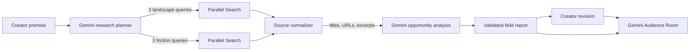

# HowItWent

> Find the whitespace around your story.

HowItWent is a creative intelligence tool for independent filmmakers, screenwriters, and digital storytellers. Before a creator spends months making something, it maps the creative territory around their premise, surfaces recurring audience friction, and turns those signals into grounded differentiation opportunities.

Built for the **Agentic Cinema Hackathon — Parallel track**.

## The problem

Creative teams can find endless AI idea generators, but very few tools answer the harder question: *What territory already surrounds this idea, what keeps recurring there, and where are audiences still underserved?*

Claims of “objective originality” are misleading. Search result counts are not an inventory of culture, and synthetic personas cannot predict real audiences.

## The solution

HowItWent researches the live web before offering advice. Its single workflow is designed for a three-minute demo:

1. Paste a story premise or load the built-in example.
2. Gemini decomposes it into six targeted research angles.
3. Parallel Search researches creative comparables and audience/critic friction concurrently.
4. Gemini synthesizes a sourced creative landscape, saturated territory, friction, and 2–4 whitespace opportunities.
5. Revise the premise and send it to the Audience Room.
6. Three synthetic perspectives compare the new iteration with the original idea and the research.

The interface labels every conclusion with calibrated language such as “sources surfaced,” “recurring signal,” and “potential whitespace.” It never claims to have searched the entire internet or certified originality.

## Agent architecture



This is intentionally one understandable orchestrator, not a large multi-agent system. Independent Parallel requests run concurrently, related queries share a session ID, and one failed branch can still produce a deliberately narrow partial report. If no evidence is returned, HowItWent does not fabricate an analysis.

## Parallel integration

Parallel is used during the live user workflow through the server-side `POST /v1/search` API. Each analysis sends two focused requests with three concise searches each:

- creative works, themes, mechanics, and tropes;
- reviews, criticism, complaints, and unmet expectations.

The API runs in `fast` mode with bounded result/context sizes for demo latency. Returned titles, URLs, dates, and excerpts remain attached to the report as numbered evidence. API keys never reach the browser.

## Gemini integration

Gemini performs three bounded reasoning tasks through its server-side `generateContent` API:

- research-query planning;
- evidence-grounded opportunity synthesis;
- revised-idea critique in the Audience Room.

All three request structured JSON. Results pass through small runtime validators before rendering, and citation IDs are restricted to URLs actually returned by Parallel.

## Run locally

Requirements: Node.js 20.9+ and API keys for [Parallel](https://platform.parallel.ai/) and [Google AI Studio](https://aistudio.google.com/).

```bash
npm install
cp .env.example .env.local
npm run dev
```

Open [http://localhost:3000](http://localhost:3000).

### Environment variables

```dotenv
PARALLEL_API_KEY=your_parallel_api_key
GEMINI_API_KEY=your_gemini_api_key
GEMINI_MODEL=gemini-2.5-flash
```

`GEMINI_MODEL` is optional; it defaults to `gemini-2.5-flash` and can be replaced with another model that supports structured output.

## Demo path

Use **Try the demo premise** to load the hackathon concept, then run live research. If credentials are unavailable during judging, **Explore a clearly labeled sample report** opens a prepared report that is explicitly marked as non-live. This never replaces or masquerades as the real Parallel integration.

## Checks

```bash
npm test
npm run build
npm audit --omit=dev
```

## Responsible claims and limitations

- Results reflect the sources surfaced for a limited set of targeted searches, not exhaustive internet coverage.
- “Saturated” and “friction” describe recurring qualitative signals, not statistically representative measurements.
- Creative whitespace is a research-grounded opportunity, not proof that a concept has never existed.
- Audience Room voices are synthetic critical lenses, not predictions of real audience behavior.
- Source quality varies across criticism, reference material, and community discussion; creators should inspect the linked evidence.
- The prepared sample report is illustrative and visibly separated from live research.

## Future improvements

Only after the core loop is proven: saved project history, richer source controls, shareable reports, and a small evidence-derived inspiration board.

## License

[MIT](LICENSE)
